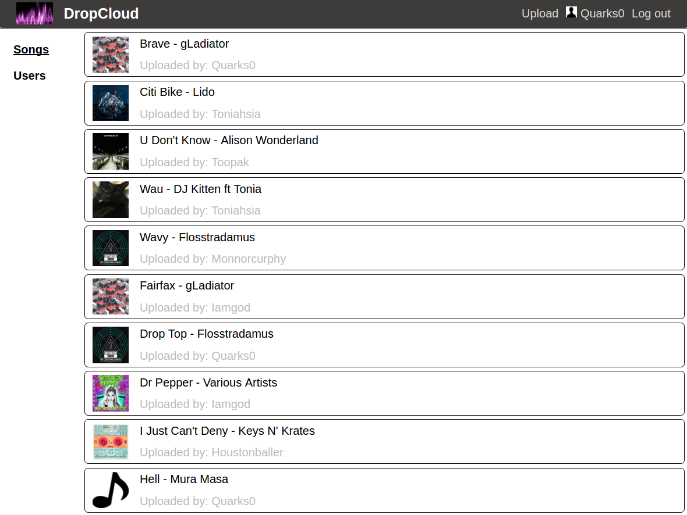
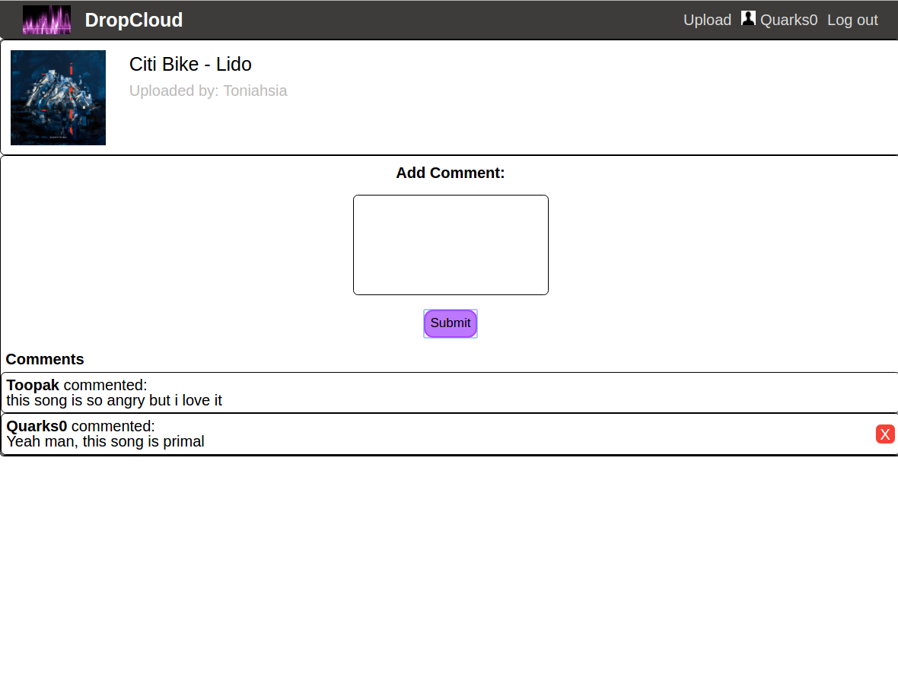
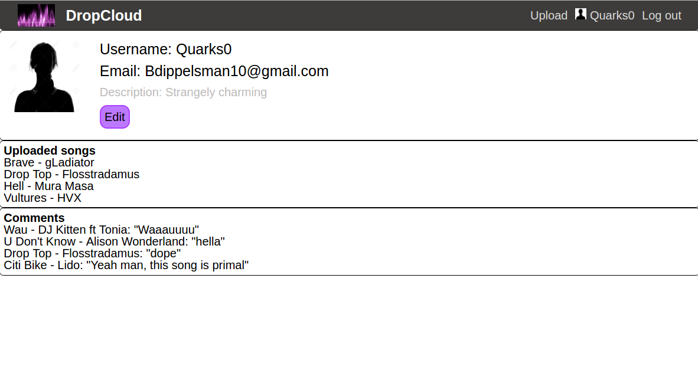

# DropCloud
[DropCloud][dropcloud]

[dropcloud]: http://dropcloud.online/

DropCloud is a music based site influenced by SoundCloud built on a Rails/Redux framework.

## Features and Implementation

### Song listings and song creation tools

DropCloud features easy and intuitive song listings, as well as upload, edit, and deletion tools. All logged in users can view all songs listed in the database, which includes song information as well as a url which allows for the implementation of song playback. Upon logging in, users are presented with the song index which will allow rendering of a specific song.

Any logged in user can upload a new song at any time through the upload button in the header, but only the song's uploader can modify the song afterwards through the song's detail page.

### Song Details and Comments

From the index page, users can view more song information as well as leaving comments on the songs. Song uploaders can edit and delete the song from the detail page. Additionally, all users can leave comments towards the bottom of the page. Users can delete their own comments.

### User Pages

Much like the song listings, users can be found through the link on the left of the page. The user page provides some basic profile information, as well as the users' uploaded songs and comments.

## Future Directions for DropCloud

DropCloud still requires additional work. The main features that would need implementation include:

### Audio playback

The ability to play music is an essential feature of sharing music. Playback would be implemented through React Player, which would be nested at the bottom of the app at all times.

### Playlists and queues

Another feature of audio playback includes playlists and/or song queues to play multiple songs in a row. This feature would be implemented through the front end framework by allowing the react player to start a new song when a previous song is done playing.

### Search bar

A search function would allow users to find any songs, comments, and users within DropCloud. This feature would likely implement the react native search bar or the masonry search package.

### User messages

An additional bonus feature would include the ability to leave messages for other users on their profile pages, or even an ingrained private messaging system between any number of users.
